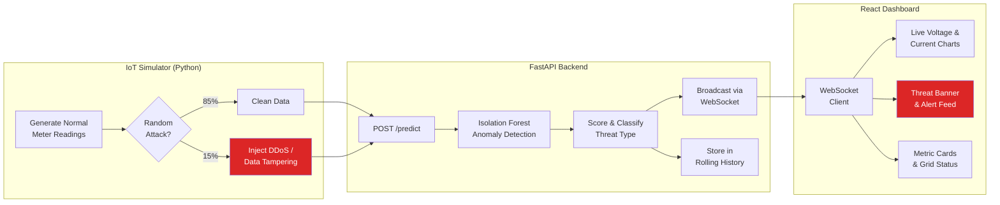

# Cyber Resilient Smart Energy Systems

**An AI-powered cybersecurity shield for smart power grids.** This system uses an Isolation Forest machine-learning model to detect DDoS floods, data-injection attacks, and sensor tampering on IoT smart meters in real time — streaming every verdict to a live React dashboard through WebSockets so grid operators can respond in seconds, not hours.

---

## Table of Contents

- [Architecture](#architecture)
- [Tech Stack](#tech-stack)
- [Getting Started](#getting-started)
- [Project Structure](#project-structure)
- [How It Works](#how-it-works)
- [Hackathon Impact](#hackathon-impact)
- [API Reference](#api-reference)
- [License](#license)

---

## Architecture



### Data Flow

```
┌─────────────────┐     POST /predict     ┌─────────────────────┐    WebSocket     ┌──────────────────┐
│  IoT Simulator   │ ──────────────────►  │   FastAPI Backend    │ ──────────────► │  React Dashboard  │
│                   │                      │                      │                  │                   │
│ • Normal meters   │                      │ • Isolation Forest   │                  │ • Live charts     │
│ • DDoS injection  │                      │ • StandardScaler     │                  │ • Threat banner   │
│ • Data tampering  │                      │ • Threat classifier  │                  │ • Alert feed      │
│ • Local ML score  │                      │ • Rolling history    │                  │ • Metric cards    │
└─────────────────┘                        └─────────────────────┘                  └──────────────────┘
```

---

## Tech Stack

| Layer | Technology | Version | Purpose |
|-------|-----------|---------|---------|
| **Runtime** | Python | 3.13 | Backend & simulator |
| **API** | FastAPI | 0.115.x | Async REST + WebSocket server |
| **Server** | Uvicorn | 0.34.x | ASGI production server |
| **ML** | scikit-learn | 1.6.x | Isolation Forest anomaly detection |
| **Numerical** | NumPy | 2.2.x | Feature matrix operations |
| **Validation** | Pydantic | 2.11.x | Request/response schemas |
| **UI** | React | 19.x | Component-based dashboard |
| **Charts** | Recharts | 3.8.x | Real-time line graphs |
| **Styling** | Tailwind CSS | 4.x | Utility-first responsive design |
| **Bundler** | Vite | 6.x | Dev server with HMR |

---

## Getting Started

### Prerequisites

- **Python 3.11+** — [python.org/downloads](https://www.python.org/downloads/)
- **Node.js 18+** — [nodejs.org](https://nodejs.org/)
- **Git** — [git-scm.com](https://git-scm.com/)

### 1. Clone the Repository

```bash
git clone https://github.com/AnandShadow/smart-grid-monitor.git
cd smart-grid-monitor
```

### 2. Start the Backend

```bash
# Install Python dependencies
cd backend
pip install -r requirements.txt

# Start the FastAPI server (runs on http://localhost:8000)
uvicorn app.main:app --host 0.0.0.0 --port 8000 --reload
```

The Isolation Forest model trains automatically on synthetic data at startup — no manual training step needed.

### 3. Start the Frontend

Open a **new terminal**:

```bash
cd frontend
npm install
npm run dev
```

Dashboard is now live at **http://localhost:5173**.

### 4. Start the IoT Simulator

Open a **third terminal**:

```bash
cd backend
python data_simulator.py
```

Optional flags:

```bash
# Custom API URL and faster streaming interval
python data_simulator.py --url http://localhost:8000 --interval 0.5
```

Data immediately begins flowing through the pipeline — open your browser to see live charts, metric cards, and threat alerts.

---

## Project Structure

```
smart-grid-monitor/
│
├── backend/
│   ├── app/
│   │   ├── __init__.py
│   │   ├── main.py             # FastAPI routes + WebSocket endpoint
│   │   ├── detector.py         # Isolation Forest ML pipeline
│   │   ├── models.py           # Pydantic schemas (MeterReading, PredictionResult)
│   │   └── simulated_data.py   # Server-side batch data generator
│   │
│   ├── data_simulator.py       # Standalone IoT simulator with attack injection
│   └── requirements.txt
│
├── frontend/
│   ├── src/
│   │   ├── App.jsx             # Root component — WebSocket hook & layout
│   │   ├── main.jsx            # React entry point
│   │   ├── index.css           # Tailwind CSS import
│   │   └── components/
│   │       ├── MetricsPanel.jsx    # Aggregate metric cards
│   │       ├── VoltageChart.jsx    # Real-time recharts line graph
│   │       ├── ThreatBanner.jsx    # Flashing "CYBER THREAT DETECTED" banner
│   │       └── AlertFeed.jsx       # Scrollable anomaly alert log
│   │
│   ├── index.html
│   ├── vite.config.js
│   └── package.json
│
├── .gitignore
└── README.md
```

---

## How It Works

### 1. Data Generation

The `data_simulator.py` script generates realistic 230V / 50Hz residential smart-meter telemetry across 10 virtual meters. Each reading includes `voltage`, `current`, `power_factor`, `frequency`, and `request_rate`.

### 2. Cyber-Attack Injection

With ~15% probability, the simulator injects one of two attack types:

| Attack Type | Simulation | Real-World Analogy |
|------------|------------|-------------------|
| **DDoS Flood** | `request_rate` spikes to 50–500 req/s | Volumetric attack on grid head-end |
| **Data Tampering** | Voltage drops to 20–100V or spikes to 300–600V; current spikes to 50–150A | MITM on Modbus/DNP3 SCADA traffic |

### 3. Isolation Forest Anomaly Detection

The system uses a **dual-layer detection architecture**:

- **Layer 1 (Simulator):** A local Isolation Forest trains on 1,000 clean samples, then scores every reading before sending it to the backend.
- **Layer 2 (Backend):** The FastAPI server runs its own Isolation Forest (trained on 2,000 samples at startup) and independently scores each reading.

**Why Isolation Forest?** It works by recursively partitioning data with random splits. Normal points require many splits to isolate (long average path length), while anomalies sit in sparse regions and are isolated quickly (short path length). This makes it ideal for unsupervised anomaly detection with no labelled attack data required.

After scoring, a rule-based classifier categorizes the threat:
- `request_rate > 10` → **DDoS / flooding**
- `voltage > 260 or < 190` → **Data injection (voltage)**
- `frequency > 51 or < 49` → **Data injection (frequency)**
- `current > 30` → **Data injection (current)**

### 4. Real-Time Streaming

The FastAPI `/ws/metrics` WebSocket endpoint broadcasts every scored reading to all connected dashboard clients the instant it's processed — zero polling, zero delay.

### 5. Dashboard Visualization

The React dashboard receives data via WebSocket and renders:
- **Metric Cards** — average voltage, current, frequency, normal/anomaly counts
- **Live Charts** — voltage and current plotted over time with red dots marking anomalies
- **Threat Banner** — a flashing red `CYBER THREAT DETECTED` alert with score and timestamp
- **Alert Feed** — scrollable log of all detected anomalies with threat classification

---

## Hackathon Impact

### Core Objective: Cybersecurity for Smart Energy Systems

This project directly addresses the vulnerability of IoT-connected smart grids to cyber-attacks. Rather than relying on static rule-based firewalls that attackers can study and bypass, the system uses **unsupervised machine learning** to learn what "normal" looks like and flag anything that deviates — including novel zero-day attack patterns it was never explicitly trained on.

### Core Objective: Intelligent Monitoring

Grid operators get a **single-pane-of-glass** dashboard that consolidates all telemetry from distributed smart meters with instant anomaly classification. The dual-layer ML architecture (edge + server) means threats are caught even if one layer is compromised.

### Bonus: AI-Driven Automation

The Isolation Forest model requires **zero manual labelling**. It trains entirely on normal data and automatically adapts its decision boundary. The backend can retrain on demand (`POST /model/retrain`) to adapt to evolving grid conditions — no data scientist intervention needed.

### Bonus: Real-Time Analytics

WebSocket streaming delivers scored readings to the dashboard in **sub-second latency**. The live recharts graphs and flashing threat banner give operators immediate situational awareness. The rolling 60-point chart window and 200-entry alert feed ensure both real-time and short-term historical context.

### Bonus: Open-Source Design

The entire stack is built on open-source technologies (FastAPI, React, scikit-learn, Tailwind CSS). The codebase is heavily commented to serve as both a functional tool and an educational resource for understanding ML-based cybersecurity in critical infrastructure.

---

## API Reference

| Method | Endpoint | Description |
|--------|----------|-------------|
| `GET` | `/health` | Server health check and model status |
| `POST` | `/predict` | Score a single `MeterReading` and broadcast via WebSocket |
| `GET` | `/predict/batch?count=20&anomaly_ratio=0.15` | Generate and score a batch of simulated readings |
| `GET` | `/history?limit=50` | Retrieve recent prediction history |
| `POST` | `/model/retrain` | Retrain the Isolation Forest on fresh synthetic data |
| `WS` | `/ws/metrics` | Real-time WebSocket stream of all scored readings |

### Example: Score a Reading

```bash
curl -X POST http://localhost:8000/predict \
  -H "Content-Type: application/json" \
  -d '{
    "meter_id": "SM-001",
    "voltage": 380.5,
    "current": 14.2,
    "power_factor": 0.95,
    "frequency": 50.01,
    "request_rate": 1.2
  }'
```

```json
{
  "meter_id": "SM-001",
  "timestamp": "2026-03-17T12:00:00Z",
  "voltage": 380.5,
  "current": 14.2,
  "power_factor": 0.95,
  "frequency": 50.01,
  "request_rate": 1.2,
  "prediction": "anomaly",
  "anomaly_score": -0.0751,
  "threat_type": "data injection (voltage)"
}
```

---

## License

This project is open source and available under the [MIT License](LICENSE).
